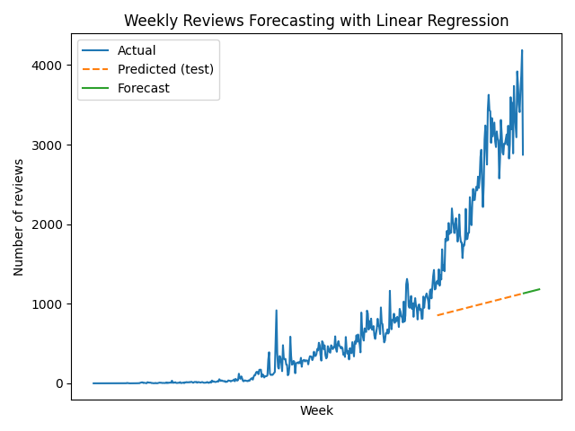
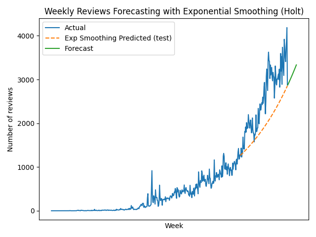

*Some formulas might not be displayed correctly in GitHub's native .md visualization. It's recommended to open this .md in VSC or some other editor that displays the math correctly.*

# P8: Forecasting (Time Series Prediction)

Build a linear regression model to forecast future values in a time series.

# Theory

## What is a stochastic process?

A stochastic process is a collection of random variables indexed by time, used to model systems that change in a random manner.
It's a way of representing the evolution of some situation that can be characterized mathematically (by numbers, points in a graph, etc.) over time.

Stochastic processes are of greatest help when you either don't know the exact rules of that evolution over time, or when the exact rule of that evolution is too complicated or costly to compute precisely.

Instead of trying to compute the exact evolution of the system, you use a *source of randomness* to help you describe the situation and its evolution. Then, using laws of probability, you may be able to compute an expected behavior over time, the probability that something desirable happens, whether the situation leads to some stable state, etc.

For example, using a queuing theory scenario, the evolution of the length of a queue waiting for a cashier over time can be modeled as a stochastic process. Knowing the exact evolution of this number over the day could come in handy to the administrators, but they don't have the exact knowledge of:

1. What makes people come at the exact times that they do
2. How many items they will bring
3. Any exceptional situations which could slow down the cashier

If the number of people in the queue at time $t$ is $N_t$, then we could consider each $N_t$ to be a random variable, because we don't know for sure what will happen at that moment.

Randomness does not necessarily imply chaotic behavior, it can also obey its own laws. For example, if $N_t = 5$, then we expect it to stay at 5 in the moments following $t$ until someone arrives or leaves at queue at some time $t + s$, and then it can only jump to the values $N_{t+s}$ = 6 or 4.

In this case, something similar to a birth and death process could represent the situation. In this process there is randomness only in the amount of time that passes between changes in the state of $N$ and in the direction in which the state changes ($\pm 1$); not in its magnitude.

In order for a stochastic process to accurately represent a given situation, its underlying assumptions must be compatible with the situation, even if only as an approximation. The modeling process may involve estimating parameters, testing hypotheses, etc.

Famous examples of stochastic processes are Brownian motion, random walk, the Black Scholes model for financial derivatives and the Poisson process.

[In layman's terms: What is a stochastic process?](https://math.stackexchange.com/questions/1470686/in-laymans-terms-what-is-a-stochastic-process)

## What is a Time Series?

A time series is a sequence of data points measured or recorded at consecutive and equally spaced time intervals.

**From *Time Series Analysis and Its Applications (Shumway & Stoffer), chapter 1.3 "Time Series Statistical Models"***:

---

In order to provide a statistical setting for describing the character of data that seemingly fluctuate in a random fashion over time, we assume a time series can be defined as a collection of random variables indexed according to the order they are obtained in time. For example, we may consider a time series as a sequence of random variables, $x_1, x_2, x_3, \dots$, where the random variable $x_1$ denotes the value taken by the series at the first time point, the variable $x_2$ denotes the value for the second time perdiod, and so on. In general, a collection of random variables ${x_t}$, indexed by $t$ is referred to as a stochastic process. $t$ will typically be discrete and vary over the integers $t = 0, \pm 1, \pm 2, \dots$, or some subset of the integers. The observed values of a stochastic process are referred to as a realization of the stochastic process.

---

  > In the book *Time Series Analysis and its applications* by Shumway & Stoffer, the term *time series* is used whether they are referring generically to the process or to a particular realization and make no notational distinction between the two concepts.

  > There's a difference between the process and the realization.
  >
  > "A stochastic process is to a time series what a random variable is to a number.
  >
  > The realization (the result, the observed value) of a random variable (e.g., a dice roll) is a number (but, as it's a random variable, we know that the number can take values from a given set according to some probability law).
  >
  > The same applies to a stochastic process, but now the realization instead of being a single number is a sequence (if the process is discrete) or a function (if it's continuous). Basically, a time series." [Difference between time series and stochastic process?](https://math.stackexchange.com/questions/19568/difference-between-time-series-and-stochastic-process).

Popular examples include daily stock prices, monthly sales and weather.

## The goal of Forecasting

Forecasting aims to predict future values in a series, based on observed patterns such as trend, seasonality, or autocorrelation.

## Linear Regression in Time Series

The simplest approach is to use linear regression with time as the independent variable. The model takes the following form:

$Y_t = \beta_0 + \beta_1 t + \epsilon_t$

Where:

* $Y_t$ is the observed value at time $t$
* $\beta_0$ is the intercept
* $\beta_1$ is the slope
* $\epsilon_t$ is the random error at time $t$

This model is suitable when the time series shows a clear and stable trend, but it doesn't capture seasonality or non-linear cycles.

## Alternatives

* **ARIMA:** Capture trend and autocorrelation; the value at time $t$ may depend directly on previous values.
* **Exponential Smoothing:** Assigns larger weights to more recent observations, useful when the time series evolves rapidly.

## Model Evaluation

A model must be evaluated for its forecasting ability. Common metrics include:

* **Mean Squared Error (MSE):** $MSE = \frac{1}{N}\sum_{i=1}^{N}(y_i - \hat{y}_i)^2$
* **Mean Absolute Error (MAE):** $MAE = \frac{1}{N}\sum_{i=1}^{N}|y_i - \hat{y}_i|$
* **Mean Absolute Percentage Error (MAPE):** $MAPE = \frac{100\%}{N}\sum_{i=1}^{N}|\frac{y_i - \hat{y}_i}{y_i}|$

# Practice

## Objective

The goal of this practice is to forecast the weekly number of Amazon Fine Food Reviews using two different time series models:

* **Linear Regression** (serves as a baseline)
* **Exponential Smoothing** (Holt’s method, for trend adaptation)

By comparing their accuracy, I analyze which model fits the data more appropriately.

## Methodology

* **Dataset:** Weekly counts of Amazon Fine Food Reviews.
* **Train/Test Split:** 80% of the series for training, 20% for testing.
* **Forecast horizon:** Both models are used to predict the following 20 weeks after the data.
* **Evaluation:** Models are evaluated with Mean Squared Error (MSE), Mean Absolute Error (MAE), and Mean Absolute Percentage Error (MAPE).

## Model Results

### Linear Regression

* **Fit:** Predicts review counts as a linear function of week number.
* **Coefficients:** Slope: 2.62, Intercept: -248.21
* **Test performance:**
    * MSE: 2821081.11
    * MAE: 1547.73
    * MAPE: 58.20%
* **Next 20 weeks forecast:** Ranges from 1132 to 1182 reviews per week.

**Interpretation:**  
Linear regression fails to capture the fluctuations and recent increases in reviews, resulting in high errors (MAPE above 50%).

### Exponential Smoothing (Holt’s method, multiplicative trend)

* **Fit:** Uses multiplicative trend (captures changes in rate of growth).
* **Test performance:**
    * MSE: 475588.16
    * MAE: 588.20
    * MAPE: 21.38%
* **Next 20 weeks forecast:** Grows from 2877 to 3334 reviews per week.

**Interpretation:**  
Exponential smoothing adapts to recent trends and increases, providing more accurate forecasts. MAPE is reduced to 21.38%.

## Discussion & Critical Analysis

* Exponential smoothing is clearly superior to linear regression for this time series, as shown by the much lower MSE, MAE, and especially MAPE.
* Linear regression is not suitable for situations where the level of the series changes significantly over time, or where recent data points are much more informative than older ones.
* Exponential smoothing is more flexible, reacts to recent variation.

## Conclusion

For forecasting weekly reviews, exponential smoothing with multiplicative trend is far more accurate than linear regression. Error metrics show that exponential smoothing reduces relative predictive error by more than half compared to the linear model.

**Best model:** Exponential Smoothing with mult trend (MAPE = 21.38%).
