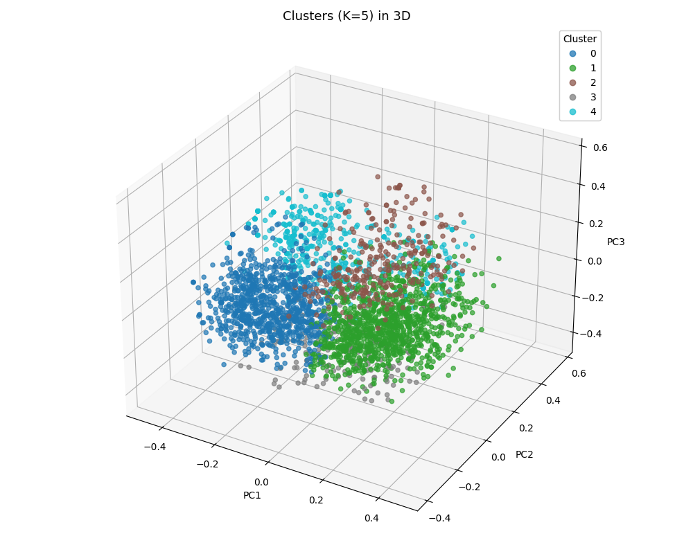

# Final project

## Objective

The goal is to discover natural subgroups of product reviews in the Amazon Fine Foods dataset by combining text embeddings (BERT) and K-means clustering.

This approach seeks to uncover "thematic" clusters, groups of products and review types that share similar topics or semantic meanings, as represented in their review summaries.

## Methodology

* **Sample:** 3000 randomly sampled reviews.
* **Text feature used:** Only the review **summary** ("title") is employed for embeddings to ensure topics and product types are highlighted, independently from review length or sentiment.
* **Embedding:** `all-MiniLM-L6-v2` model from SentenceTransformers, each summary is transformed into an embedding capturing semantic content.
* **Clustering algorithm:** K-means, for k = 3 to 9 clusters, each repeated for 3 seeds.
* **Cluster selection:** The best clustering (highest Silhouette score among all runs) is selected.
* **Metrics calculated:**
  - **Silhouette score:** Measures overall cluster separability.
  - **Top words per cluster** using TF-IDF.
  - **Mean product rating and cluster size**.
  - **Internal cluster cohesion:** Mean distance of all points to their cluster centroid (lower is better, shows compactness).

## Clustering Results

### Selection & Key Metrics

* **Best run:** K = 5
* **Silhouette score:** 0.0379
* **Cluster sizes:**
    - Cluster 0: 899
    - Cluster 1: 1063
    - Cluster 2: 287
    - Cluster 3: 184
    - Cluster 4: 567

### Cluster Summaries

#### **Cluster 0**
- **Mean score:** 3.55
- **Unique products:** 846
- **Top words:** good, best, great, price, just, product, love, ok, quality, better, yum, disappointed
- **Sample summary:**
    > "Not Bigelow's best ..."

**Interpretation:**
General product reviews with high product variety.

#### **Cluster 1**
- **Mean score:** 4.26
- **Unique products:** 977
- **Top words:** great, best, taste, good, delicious, flavor, chocolate, tasty, like, snack, healthy, free
- **Sample summary:**
    > "Welcome Home Cracker Meal ..."

**Interpretation:**
Highly positive reviews about taste and deliciousness, strong presence of chocolate and snacks.

#### **Cluster 2**
- **Mean score:** 4.47
- **Unique products:** 265
- **Top words:** coffee, tea, great, best, good, cup, drink, love, cups, green, delicious, favorite
- **Sample summary:**
    > "Tea from the UK ..."

**Interpretation:**
Cluster focused on beverages, especially coffee and tea, likely reflecting a topic-based segmentation.

#### **Cluster 3**
- **Mean score:** 4.52
- **Unique products:** 160
- **Top words:** dog, love, loves, dogs, cat, food, great, treats, cats, puppy, treat, best
- **Sample summary:**
    > "Feline Greenies ..."

**Interpretation:**
Cluster highly specific to pet food (dogs/cats), reviews mention animals, and treats.

#### **Cluster 4**
- **Mean score:** 4.86
- **Unique products:** 541
- **Top words:** great, good, excellent, product, love, yummy, delicious, best, awesome, tasty, taste, stuff
- **Sample summary:**
    > "Great ..."

**Interpretation:**
Generally positive, high-praise reviews across varied products, summary words indicate overall satisfaction.

### Internal Cohesion (Mean Distance to Centroid)

Lower values indicate more semantically-cohesive clusters:

- Cluster 0: 0.9227
- Cluster 1: 0.8453
- Cluster 2: 0.7551
- Cluster 3: 0.7745
- Cluster 4: 0.7933

Cluster 2 ("beverages") and Cluster 3 ("pet food") are the tightest (most consistent in themes and language).

## Results analysis

The clusters, while not strongly separated (global Silhouette is around 0.04, common for short-text clustering), display meaningful thematic separation as confirmed by top words and examples. Topic-based (products/types) clusters naturally arise without using explicit product categories.

Despite low Silhouette score, intra-cluster cohesion and word-topic analysis validate robust thematic clusters. This analytical approach offers a way to discover hidden topical niches valuable for targeted recommendations, marketing, or further study.
